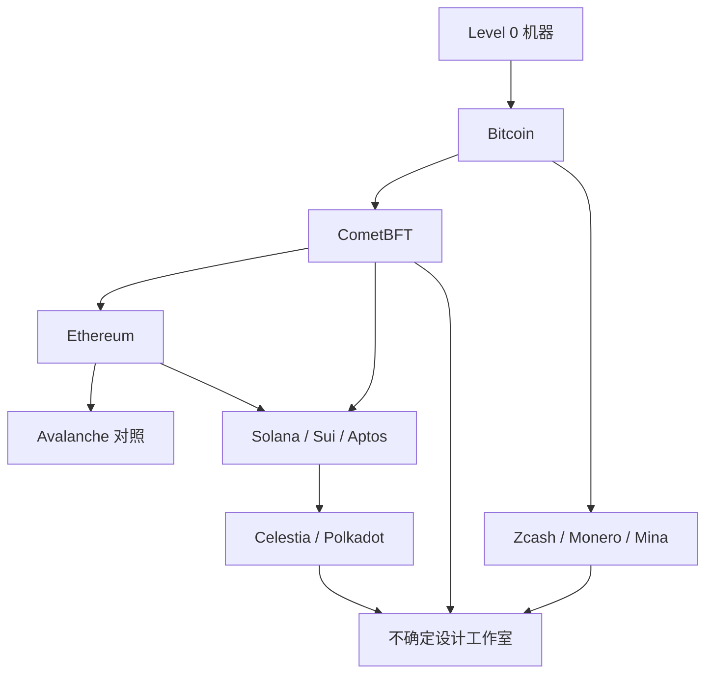

# 核心公链研究顺序

顺序是教学顺序，不是「谁更高级」。

原则：

1. 先学**完整且慢**的系统，再学**快且复杂**的系统。
2. 先学「不确定」更可能直接采用的骨架，再学别人用性能换来的代价。
3. 先学能用全节点手算理解的机制，再学必须靠证明系统相信的机制。
4. 有名不是入选理由。独特思想才是。

---

## 总顺序

```text
第 1 波  Bitcoin
第 2 波  Cosmos / CometBFT
第 3 波  Ethereum
第 4 波  Avalanche          （对照，不是主骨架）
第 5 波  Solana → Sui → Aptos
第 6 波  Celestia → Polkadot
第 7 波  Zcash → Monero → Mina
第 8 波  按「独特思想过滤器」择优
```

对应课程 Level：L3 → L4 → L5 → L4/L5 对照 → L6 → L7 → L8 → L9/L10。

---

## 第 1 波 · Bitcoin · 必学

### 为什么第一

Bitcoin 是目前唯一同时满足下面四条的教学对象：

1. 状态模型足够小：UTXO，不必先懂虚拟机。
2. 共识规则足够硬：最重链，不必先懂轮次锁。
3. 运行时间足够长：能回答「什么设计经得起十年」。
4. 全节点文化足够强：用户可以自己验证，而不是「看浏览器」。

### 这一波必须回答

- 为什么最长/最重链 + 概率最终性，仍然能成为结算层？
- 为什么保守的协议演化，本身就是安全特性？
- 为什么全节点可验证，比「官方说没问题」更重要？

### 现在不深入的

Taproot 脚本细节、Miniscript、闪电网络路由。先建立主骨架。

### 对「不确定」的预告

**建议（不是事实）：**  
「不确定」如果想做后量子结算，第一件该偷的不是 PoW，而是：

- 规则少
- 变更慢
- 任何全节点都能重放历史
- 升级不依赖万能管理员

---

## 第 2 波 · Cosmos / CometBFT · 必学

### 为什么第二，而不是 Ethereum

「不确定」大概率需要：

- 确定最终性（用户不能接受「再等 6 个块也许能逆」作为结算语义）
- 应用与共识分离（方便以后换执行、换签名、做实验）
- 明确的验证者集合（后量子投票流量必须可计算）

CometBFT 把这些摊在桌面上。Ethereum 把它们和虚拟机、费用、MEV、多客户端缠在一起。

### 这一波必须回答

为什么

```text
Propose → Prevote → Precommit → Commit
```

不能简化成

```text
大家投票 → 2/3 通过 → 完事
```

答案会涉及：两个合法提案、法定人数相交、锁、解锁、超时、崩溃恢复。  
这是整个 Atlas 里对「不确定」最值钱的一段。

### 现在不深入的

IBC 全协议、CosmWasm 生态、每个 Cosmos 应用链。先把引擎看懂。

---

## 第 3 波 · Ethereum · 重要

### 为什么第三

现在你已经有：

- 一种简单状态模型（UTXO）
- 一种确定最终性的 BFT
- 「复制状态机」的口语

这时再看 Ethereum，才不会把它当成「Bitcoin 加了智能合约」。

Ethereum 真正该学的是：

1. Account + EVM 如何把「任意程序」放进状态转移
2. gas 如何防止无限循环变成网络武器
3. 为什么故意允许多个独立客户端
4. 如何让不同实现执行同一交易仍得到同一结果
5. 状态膨胀、MEV、rollup 这些是**成功之后的新病**

### 这一波必须回答

- 多客户端是多样性，还是额外的共识风险？
- 可执行规范、差分测试、状态根，各自守哪一层保证？

### 对「不确定」的预告

**建议：** 第一版不要抄 EVM 作为结算核心。  
**要抄的是：** 规范必须精确到「两个实现不能偷偷不一致」。

---

## 第 4 波 · Avalanche · 重要（对照）

### 为什么在 Ethereum 之后、Solana 之前

Avalanche 的独特思想是：

> 不靠领袖广播一个块，也不靠全员两轮投票；靠反复随机抽样，让偏好像雪崩一样固化。

它既不是 Nakamoto，也不是经典 PBFT。  
此时插入，是为了打破「共识只有两条路」的假二分。

### 必须回答

- 为什么每轮只问少量验证者，巨大网络仍可能趋向一致？
- 概率共识与 BFT 确定最终性，用户体验和安全假设差在哪？
- 和 Bitcoin / Tendermint 比，它拿什么换来了什么？
- 抽样 α 多数为什么不是全集 +2/3 证书？连续 β 为什么不是可转发 QC？精读：[`../tracks/consensus/worked-example-snow-sample-vs-qc.md`](../tracks/consensus/worked-example-snow-sample-vs-qc.md)（不变量 131）

### 定位

对照项目，不是「不确定」默认骨架。  
先写比较，再决定要不要做完整 19 节深挖。

---

## 第 5 波 · Solana → Sui → Aptos · 重要

### 为什么三个放在一起，且排在后面

高吞吐链的秘密几乎都不在「共识品牌名」，而在：

1. 状态模型是否让冲突可见
2. 执行器是否能并行
3. 网络是否按块切片传播
4. 费用是否能隔离热点
5. 硬件是否被协议假设成「很强」

三个项目给出三种并行世界观：

| 链 | 并行思想 | 先学它为了什么 |
|---|---|---|
| Solana | 交易预先列出要锁的账户；PoH 是钟，Tower 才是票 | 理解声明式冲突；`processed` ≠ `confirmed` ≠ `finalized`。精读：[`../tracks/consensus/worked-example-poh-vs-tower.md`](../tracks/consensus/worked-example-poh-vs-tower.md) |
| Sui | 对象所有权决定要不要进共识 | 理解「有些交易可以绕过全网排序」 |
| Aptos | 先乐观并行，冲突再回滚；Quorum Store 先传播再排序 | 理解「未完全定序也能执行」；已认证批次 ≠ L。精读：[`../tracks/consensus/worked-example-quorum-store-vs-order.md`](../tracks/consensus/worked-example-quorum-store-vs-order.md) |

顺序：Solana（最工程化的账户锁定）→ Sui（世界观变化最大）→ Aptos（乐观并行最需要形式直觉）。

### 必须拆开，禁止的一句话

禁止只回答「因为硬件好」。

必须分别写出：

- 协议贡献了什么
- 执行贡献了什么
- 网络贡献了什么
- 状态模型贡献了什么
- 硬件贡献了什么

### 对「不确定」的预告

**建议：** 结算链先问「冲突有多少」，再问「能不能并行」。  
后量子验签本身就贵，盲目追 TPS 会把区块和内存池炸开。

---

## 第 6 波 · Celestia → Polkadot · 重要

### 为什么在吞吐之后

你已经理解「执行可以很快」。  
现在必须理解一个更狠的问题：

> 我验证了区块头，并不等于我拥有验证状态所需要的数据。

Celestia 把 Data Availability 单独拎出来。  
Polkadot 把「小链借用大链安全」做成系统。

先 DA，后共享安全：因为共享安全里也有 availability 子协议。

### 必须回答

- DA 到底是什么？
- 数据扣留如何让轻节点上当？
- 一条小链「借用安全」时，攻击面如何从「攻破小验证者集合」变成「骗过中继链的可用性/审批」？

---

## 第 7 波 · Zcash → Monero → Mina · 进阶

### 为什么最晚

隐私和简洁证明需要：

- 承诺
- Merkle 树
- 空值器 / 键镜像这类「能证明花过、又不指出是哪笔」的对象
- 对「链上公开字段」极度敏感

没有 L1–L3，Zcash 会退化成那句假解释：

> 零知识证明可以证明一件事而不透露内容。

那句话正确，但几乎无用。

顺序：

1. **Zcash**：最值得「不确定」学的隐私结算思想。链知道什么、不知道什么、为何仍能防双花。
2. **Monero**：另一套世界（环签名、诱饵）。用来对照，避免以为隐私只有 ZK 一条路。
3. **Mina**：递归证明把历史压成小证明。研究级，服务「轻客户端 / 后量子证明大小」问题。

---

## 第 8 波 · 择优，不因有名而学

过滤器：

```text
它提供了什么 Bitcoin / CometBFT / Ethereum / Solana / Sui / Aptos
 / Celestia / Polkadot / Zcash / Monero / Mina
很少同时具备的思想？
```

过不了这关：降优先级，最多写一页对照，不写 19 节。

初步判断（推断，待研究后修正）：

| 值得排队 | 原因 |
|---|---|
| Arbitrum / Optimism | 乐观滚动是模块化执行的另一半（品类 19 节已写）。`unsafe` / `latest` ≠ 已经从 L1 推导；OP `safe` ≠ Gasper justified；L2 `finalized` ≠ 桥已兑付：[`../tracks/finality/worked-example-unsafe-vs-derived.md`](../tracks/finality/worked-example-unsafe-vs-derived.md)（不变量 141）。DACert ≠ 全文已经贴上父链：[`../tracks/light-clients/worked-example-dacert-vs-posted.md`](../tracks/light-clients/worked-example-dacert-vs-posted.md)（不变量 142） |
| Algorand | 密码抽签（19 节已写，对照不是默认骨架）。VRF 抽中 ≠ 已经认证：[`../tracks/consensus/worked-example-vrf-sortition-vs-certified.md`](../tracks/consensus/worked-example-vrf-sortition-vs-certified.md)（不变量 134） |
| Kaspa | 区块 DAG（档案+L3.8 已写）。进了某个块 ≠ 已经在 selected chain：[`../tracks/consensus/worked-example-dag-vs-selected-chain.md`](../tracks/consensus/worked-example-dag-vs-selected-chain.md)（不变量 137） |
| Fuel | UTXO+调度（思想级档案已写） |
| Nervos | 容量绑定存储 + 生成/验证分离（思想级档案 + L2.6） |
| NEAR | 一条链 + chunk（思想级档案）。Doomslug / `near-final` ≠ BFT 谓词 / `final`：[`../tracks/finality/worked-example-doomslug-vs-bft.md`](../tracks/finality/worked-example-doomslug-vs-bft.md)（不变量 135） |
| Babylon | BTC UTXO 留在 Bitcoin（仅过滤器页，无 19 节）。k-deep 包含证明 ≠ 已经 commit；解绑意图 ≠ 已经 k-deep：[`../tracks/economic/worked-example-btc-lock-vs-commit.md`](../tracks/economic/worked-example-btc-lock-vs-commit.md)（不变量 139） |
| Cardano | eUTXO（L2.5 已写，不写全生态） |
| 真实 PQ 部署实验 | 有状态 XMSS 部署：QRL 仅过滤器页；思想卡 `tracks/post-quantum/stateful-hbs.md` |
| Monad | 异步执行：共识先定序、本块无状态根（仅过滤器页；官方文档，无 19 节）。顺序已定 ≠ 本块根已交差：[`../tracks/consensus/worked-example-order-vs-state.md`](../tracks/consensus/worked-example-order-vs-state.md)（不变量 136） |
| Starknet | 有效性租户（仅过滤器页；官方文档，无 19 节）。`CANDIDATE` / `PRE_CONFIRMED` ≠ `ACCEPTED_ON_L2` ≠ `ACCEPTED_ON_L1`：[`../tracks/finality/worked-example-l2-status-vs-l1.md`](../tracks/finality/worked-example-l2-status-vs-l1.md)（不变量 138） |
| EigenLayer | 已质押 ETH/LST 再声明 + AVS 自定、不必客观可归属的罚没（仅过滤器页；ELIP-002 / 产品文档，无 19 节）。AVS 罚没 ≠ Casper：[`../tracks/economic/worked-example-avs-slash-vs-casper.md`](../tracks/economic/worked-example-avs-slash-vs-casper.md)（不变量 140） |

默认后置：

- 纯生态热度项目
- 只是 EVM 换共识皮肤的项目
- 只有 token 模型没有协议新思想的项目

---

## 横向重排（项目学完立刻做）

每学完一波，不要立刻跳下一条链。先更新这些表：

1. 状态模型地图
2. 共识地图
3. 最终性类型
4. 并行策略
5. 轻节点假设
6. 升级机制
7. 失败案例
8. 「不确定」适用 / 不适用

否则你会得到 12 份孤立读书笔记，而不是一张图谱。

---

## 一张图：顺序与你的能力



---

## 现在你该做什么

不要开始收集官网对比图。  
课程 L0–L10 与主线 19 节已在仓库。先按 Level 读，再按 `tracks/` 横读。  
「不确定」决策列仍空。统一考试后置。
